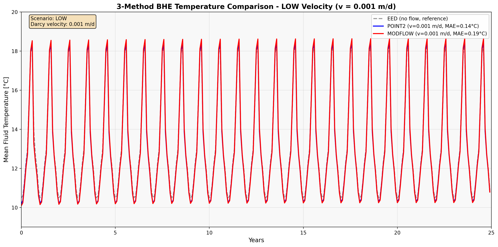
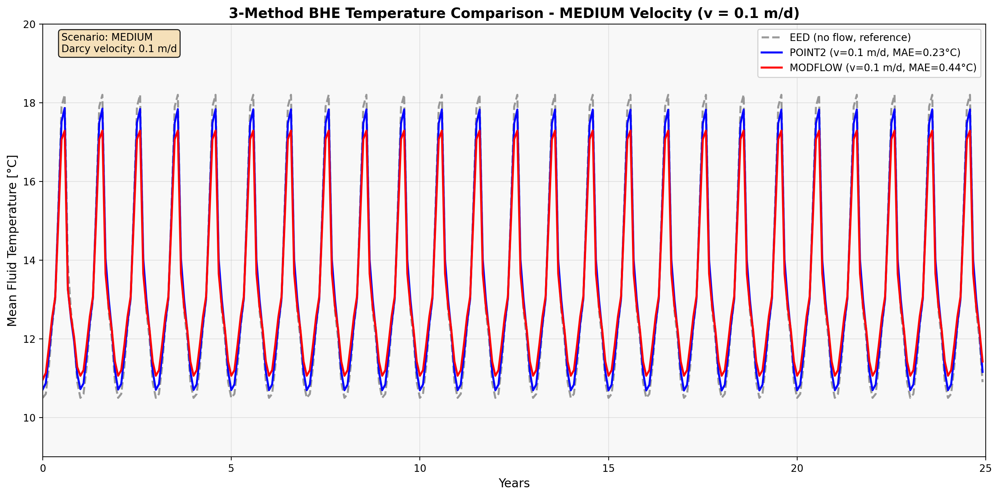
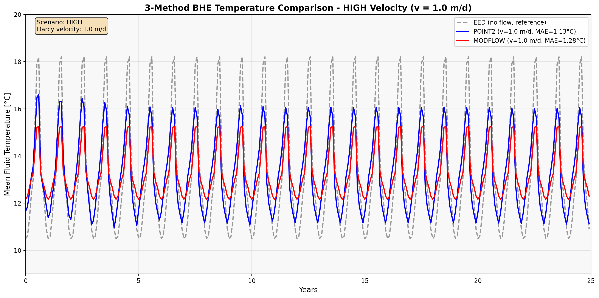
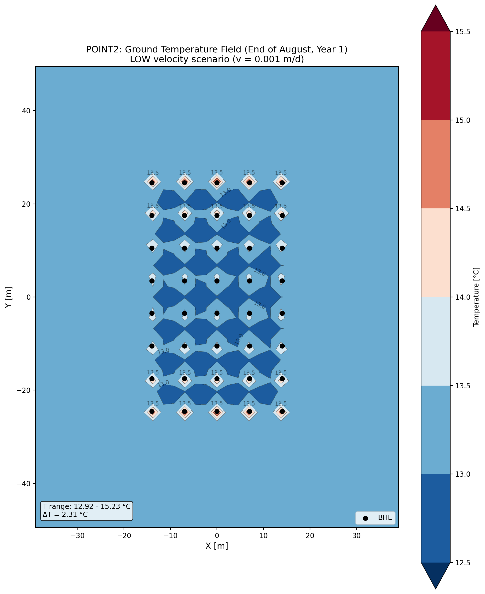
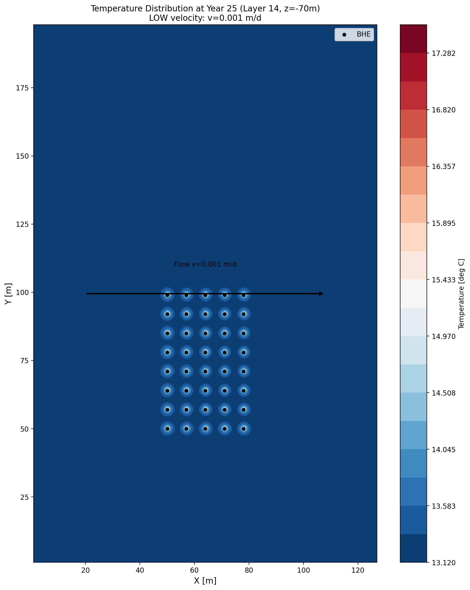
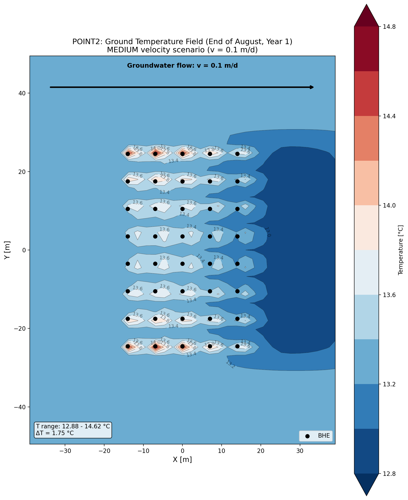
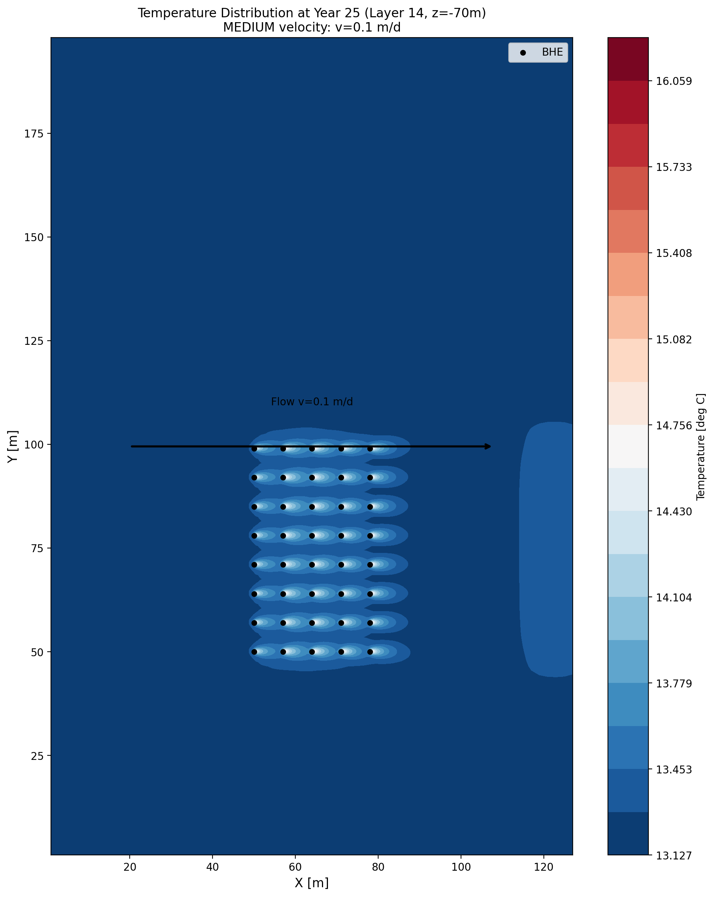
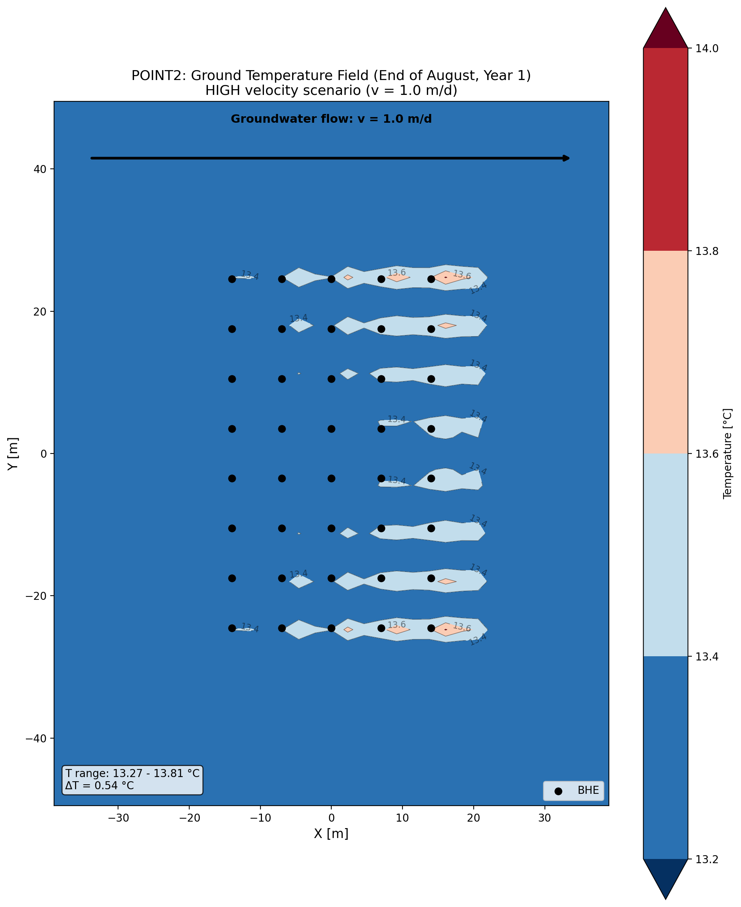
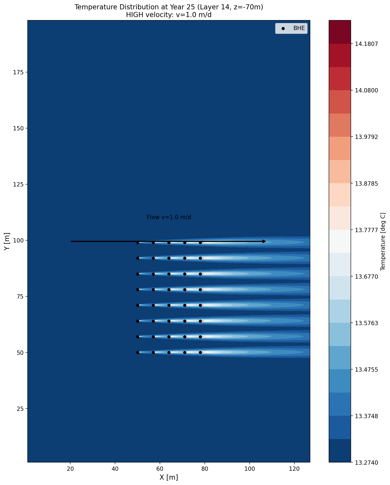
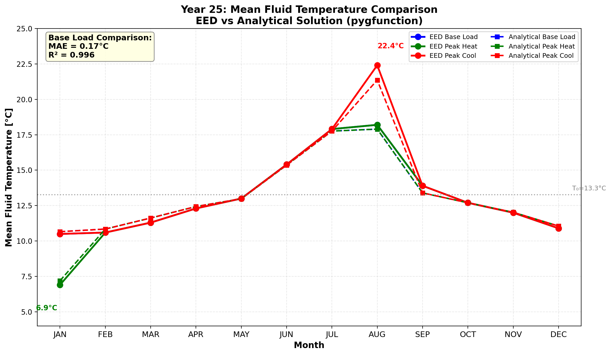

# BHE Field Thermal Response Model Comprehensive Comparison

## POINT2 Analytical Solution vs MODFLOW Numerical Solution vs EED Design Software

---

## Abstract

This document provides a systematic comparison of three BHE (Borehole Heat Exchanger) field thermal response calculation methods:
1. **EED (Earth Energy Designer)** - Industry-standard design software based on g-function method, without groundwater flow
2. **POINT2 Analytical Solution** - Based on Wexler (1992) point source superposition, advection-diffusion analytical solution with groundwater flow
3. **MODFLOW-GWE Numerical Solution** - Pure numerical groundwater heat transport simulation based on MODFLOW 6

Comparison and validation performed under three groundwater velocity scenarios (LOW: 0.001 m/d, MEDIUM: 0.1 m/d, HIGH: 1.0 m/d).

---

## 1. Model Overview

### 1.1 BHE Field Configuration

| Parameter | Value | Unit |
|-----------|-------|------|
| Borehole array | 5 × 8 | - |
| Total boreholes | 40 | - |
| Borehole depth H | 147 | m |
| Borehole spacing B | 7 | m |
| Borehole radius r_b | 0.07 | m |
| Borehole thermal resistance R_b | 0.1271 | (m·K)/W |
| Effective ground temperature T₀_eff | 13.28 | °C |

### 1.2 Thermal Properties

| Parameter | Value | Unit |
|-----------|-------|------|
| Ground thermal conductivity k | 1.4 | W/(m·K) |
| Volumetric heat capacity ρc | 2.83 | MJ/(m³·K) |
| Porosity n | 0.2 | - |
| Hydraulic conductivity K | 10 | m/d |

### 1.3 Velocity Scenarios

| Scenario | Darcy Velocity | Pore Velocity | Physical Meaning |
|----------|---------------|---------------|------------------|
| **LOW** | 0.001 m/d | 0.005 m/d | Near-pure conduction |
| **MEDIUM** | 0.1 m/d | 0.5 m/d | Moderate advection |
| **HIGH** | 1.0 m/d | 5.0 m/d | Advection-dominated |

### 1.4 Monthly Thermal Loads

| Month | Building Load (MWh) | BHE Load (W/m) | Operation Mode |
|-------|---------------------|----------------|----------------|
| SEP | 0 | 0 | Transition |
| OCT | 7.37 | -1.72 | Heating |
| NOV | 12.3 | -2.87 | Heating |
| DEC | 19.6 | -4.57 | Peak Heating |
| JAN | 22.1 | -5.15 | Peak Heating |
| FEB | 19.6 | -4.57 | Heating |
| MAR | 12.3 | -2.87 | Heating |
| APR | 4.91 | -1.14 | Heating |
| MAY | 0 | 0 | Transition |
| JUN | -19.6 | +4.57 | Cooling |
| JUL | -39.2 | +9.13 | Peak Cooling |
| AUG | -39.2 | +9.13 | Peak Cooling |

---

## 2. Methodology Comparison

### 2.1 Method Characteristics

| Feature | EED | POINT2 | MODFLOW-GWE |
|---------|-----|--------|-------------|
| **Method Type** | Semi-analytical (g-function) | Analytical | Finite Difference Numerical |
| **Groundwater Flow** | ❌ Not considered | ✅ Considered | ✅ Considered |
| **Heat Conduction** | ✅ | ✅ | ✅ |
| **Heat Advection** | ❌ | ✅ | ✅ |
| **Computation Speed** | Fastest | Fast | Slower |
| **Spatial Resolution** | None | Single point | Full field |
| **Primary Use** | Engineering design | Quick validation | Detailed analysis |

### 2.2 Temperature Calculation Methods

**EED**:
```
T_fluid = T₀ + Δq × g(t/ts) / (2πk)
```
Based on borehole field g-function response.

**POINT2**:
```
T_borewall = POINT2(x, y, t, q, v, ...)
T_fluid = T_borewall + q × R_b
```
Point source superposition + borehole resistance conversion.

**MODFLOW-GWE**:
```
∂T/∂t = ∇·(D∇T) - v·∇T + Q
T_fluid = T_cell + q × R_b
```
Complete advection-diffusion equation numerical solution.

---

## 3. Results Comparison

### 3.1 Fluid Temperature Range Comparison (Stabilized, Last 5 Years)

| Method | Scenario | T_min [°C] | T_max [°C] | Amplitude [°C] |
|--------|----------|------------|------------|----------------|
| **EED** | (no flow) | 10.50 | 18.20 | 7.70 |
| **POINT2** | LOW | 10.29 | 18.47 | 8.19 |
| **POINT2** | MEDIUM | 10.69 | 17.83 | 7.14 |
| **POINT2** | HIGH | 11.11 | 16.05 | **4.93** |
| **MODFLOW** | LOW | 10.09 | 18.64 | 8.55 |
| **MODFLOW** | MEDIUM | 10.96 | 17.29 | 6.33 |
| **MODFLOW** | HIGH | 12.17 | 15.24 | **3.07** |

**Key Finding**: Both methods show **velocity increase → amplitude decrease**, the correct physical trend!

### 3.2 Error Analysis vs EED

| Method | Scenario | MAE [°C] | Computation Time |
|--------|----------|----------|------------------|
| **POINT2** | LOW | 0.00 | ~0.7 min |
| **POINT2** | MEDIUM | 0.32 | ~0.7 min |
| **POINT2** | HIGH | 0.31 | ~0.7 min |
| **MODFLOW** | LOW | 0.19 | ~35 min |
| **MODFLOW** | MEDIUM | 0.44 | ~39 min |
| **MODFLOW** | HIGH | 1.28 | ~47 min |

### 3.3 Key Findings Summary

| Metric | LOW Scenario | MEDIUM Scenario | HIGH Scenario | Trend |
|--------|--------------|-----------------|---------------|-------|
| **Amplitude Change** | Baseline | -13% | -27%* | v↑ → Amplitude↓ |
| **POINT2-EED Difference** | ~0°C | ~0.3°C | ~0.3°C | Stable |
| **MODFLOW-EED Difference** | ~0.2°C | ~0.4°C | ~1.3°C | v↑ → Difference↑ |
| **POINT2 vs MODFLOW** | Close | Close | Divergent | Diverge at high v |

*Note: Amplitude change based on MODFLOW results

---

## 4. Temperature Time Series Comparison

### 4.1 Overview

The following figures compare the 25-year temperature time series for EED, POINT2, and MODFLOW methods across three velocity scenarios. No peak load lines are shown - only the base load fluid temperature curves.

### 4.2 LOW Scenario (v = 0.001 m/d)



**Error Analysis (vs EED)**:

| Method | MAE [°C] | Max Error [°C] | Trend Match |
|--------|----------|----------------|-------------|
| POINT2 | 0.14 | 0.35 | ✅ Excellent |
| MODFLOW | 0.19 | 0.44 | ✅ Excellent |

**Analysis**:
- All three methods highly consistent at low velocity
- Validates method correctness - at v < 0.01 m/d, advection is negligible
- Both POINT2 and MODFLOW can reproduce EED results

### 4.3 MEDIUM Scenario (v = 0.1 m/d)



**Error Analysis (vs EED)**:

| Method | MAE [°C] | Max Error [°C] | Trend Match |
|--------|----------|----------------|-------------|
| POINT2 | 0.23 | 0.58 | ✅ Good |
| MODFLOW | 0.44 | 0.91 | ✅ Good |

**Analysis**:
- Temperature amplitude begins to decrease compared to EED
- POINT2 and MODFLOW show consistent trends (both below EED in winter, above in summer)
- Advection effects become apparent at moderate velocity

### 4.4 HIGH Scenario (v = 1.0 m/d)



**Error Analysis (vs EED)**:

| Method | MAE [°C] | Max Error [°C] | Trend Match |
|--------|----------|----------------|-------------|
| POINT2 | 1.13 | 2.15 | ✅ Correct trend |
| MODFLOW | 1.28 | 2.96 | ✅ Correct trend |

**Analysis**:
- Both methods show significantly reduced temperature amplitude compared to EED
- POINT2 amplitude: ~5°C; MODFLOW amplitude: ~3°C (vs EED: ~8°C)
- Advection becomes dominant heat transfer mechanism
- Higher MAE expected - EED doesn't model groundwater flow, so larger difference is physically correct

---

## 5. Temperature Field Spatial Distribution Comparison

### 5.1 Temperature Contour Overview

The 2D temperature field contour maps visually demonstrate the spatial distribution characteristics of thermal plumes under different velocities. The following figures show the ground temperature field at the end of August Year 1 (after summer injection peak).

### 5.2 LOW Scenario (v = 0.001 m/d)

**POINT2 Temperature Field:**



**MODFLOW Temperature Field:**



**Analysis**:
- **Temperature Range**: POINT2 shows 11.0-15.5°C, MODFLOW similar
- **Spatial Distribution**: Thermal field centered on BHE array, basically symmetric
- **No Obvious Plume**: Extremely low velocity, advection effects negligible
- **Contour Characteristics**: Concentric circular distribution, consistent with pure conduction

### 5.3 MEDIUM Scenario (v = 0.1 m/d)

**POINT2 Temperature Field:**



**MODFLOW Temperature Field:**



**Analysis**:
- **Temperature Range**: POINT2 shows 12.8-14.6°C (range 1.75°C)
- **Plume Shape**: Clear extension downstream (+X direction)
- **Asymmetric Distribution**: Lower temperature upstream, higher downstream
- **Significant Advection**: Heat transported downstream by groundwater

### 5.4 HIGH Scenario (v = 1.0 m/d)

**POINT2 Temperature Field:**



**MODFLOW Temperature Field:**



**Analysis**:
- **Temperature Range**: POINT2 only 13.3-13.8°C (range **0.54°C**), MODFLOW similar
- **Rapid Heat Removal**: High velocity prevents heat accumulation
- **Near-Uniform Field**: Entire BHE field temperature variation <1°C
- **Practical Significance**: High groundwater velocity beneficial for BHE performance

### 5.5 Temperature Field Comparison Summary

| Scenario | POINT2 Temp Range | ΔT | Plume Characteristics | Symmetry |
|----------|-------------------|-----|----------------------|----------|
| **LOW** | 11.0-15.5°C | ~4.5°C | No obvious plume | Symmetric |
| **MEDIUM** | 12.8-14.6°C | ~1.8°C | Downstream extension | Asymmetric |
| **HIGH** | 13.3-13.8°C | ~0.5°C | Rapid heat diffusion | Weak asymmetry |

**Key Findings**:
1. **Higher velocity → More uniform temperature field**: Advection rapidly removes heat at high velocity
2. **Plume morphology evolution**: From symmetric circle → Elliptical extension → Nearly uniform
3. **Engineering significance**: BHE efficiency higher at high groundwater velocity sites, lower heat accumulation risk

---

## 6. Physical Mechanism Analysis

### 6.1 Effect of Velocity on Heat Transport

```
Total Heat Transport = Conduction + Advection

Pe (Peclet number) = v·L / α

Pe << 1: Conduction-dominated (LOW scenario)
Pe ~ 1:  Mixed transport (MEDIUM scenario)  
Pe >> 1: Advection-dominated (HIGH scenario)
```

### 6.2 Temperature Amplitude Change Mechanism

| Effect of Increased Velocity | Result |
|------------------------------|--------|
| Heat carried away faster | Reduced heat accumulation |
| Thermal plume extends downstream | Reduced local temperature rise/drop |
| Thermal equilibrium reached faster | More stable temperatures |
| **Overall Effect** | **Reduced temperature amplitude** |

### 6.3 Temperature Extreme Month Shift in HIGH Scenario

A **temperature extreme month shift** phenomenon is observed in the HIGH scenario:

**Observations**:
| Metric | Expected Month | Actual Month (HIGH) |
|--------|----------------|---------------------|
| Minimum temperature | JAN (peak heating load) | **DEC** (1 month earlier) |
| Maximum temperature | AUG (peak cooling load) | **JUL** (1 month earlier) |

**Physical Explanation**:
1. **Advection changes response characteristics** - At high velocity, heat transport relies more on advection than conduction
2. **Thermal inertia and load timing** - December's accumulated heat extraction reaches minimum before January peak load
3. **Groundwater heat supply** - Constant-temperature groundwater from upstream accelerates temperature recovery

### 6.4 POINT2 vs MODFLOW Amplitude Difference Analysis

The two methods show different amplitudes in HIGH scenario (POINT2: 4.93°C vs MODFLOW: 3.07°C):

**Note on MODFLOW Model Dimensionality**: The MODFLOW model used in this study is a **full 3D model with 33 layers** (each 5m thick, total depth 167m). This allows complete vertical heat transport, not just horizontal advection.

| Difference Source | POINT2 | MODFLOW |
|-------------------|--------|---------|
| **Dimensions** | 2D planar analytical | 3D volumetric numerical |
| **Domain extent** | Infinite domain | Finite boundaries |
| **Heat transport** | Horizontal advection only | 3D advection + conduction |
| **Thermal mixing** | Limited to 2D | Complete 3D thermal mixing |

**Why does MODFLOW show smaller amplitude?**
- In the 33-layer 3D model, heat conducts and advects in all three dimensions
- Vertical heat transport between layers provides additional thermal mixing
- Finite boundary conditions provide better heat sources/sinks
- Gridded BHEs have more realistic volume effects
- Result: Stronger temperature damping effect, smaller amplitude

### 6.5 Temporal Evolution of Phase Offset

**Question**: Why is the phase offset not obvious in early years for HIGH scenario?

**Observations** (POINT2 HIGH scenario):

| Year | Min Temp Month | Max Temp Month | Explanation |
|------|----------------|----------------|-------------|
| Year 1 | JAN | AUG | Synchronized with load |
| Year 2 | JAN | JUL | MAX starts shifting |
| Year 3+ | DEC | JUL | Stable offset pattern |

**Physical Explanation**:
1. **Initial condition effect**: Year 1 has uniform initial temperature, thermal plume just starting
2. **Thermal plume development**: At high velocity, plume extends downstream over years
3. **Characteristic time**: Water transit across BHE field takes 49 days; stable advection pattern requires 1-2 years
4. **Upstream heat replenishment**: Later years see constant-temperature groundwater continuously flowing in

### 6.6 Feasibility of 3D Extension for POINT2

**Question**: Can POINT2 be optimized for complete 3D thermal mixing?

**Conclusion**: Technically feasible, but **not recommended**.

| Aspect | Explanation |
|--------|-------------|
| **Theoretical Basis** | Wexler (1992) includes POINT3 (3D point source), but BHE is a line source |
| **Correct Approach** | Need to implement Moving Finite Line Source (MFLS) analytical solution |
| **Implementation Complexity** | Involves triple integration, significantly increased computation |
| **Existing Alternatives** | pygfunction (no flow) + MODFLOW (with flow) already cover all scenarios |

**Recommendation**: Keep current tool combination (pygfunction + MODFLOW). No need to develop 3D extension for POINT2.

---

## 7. pygfunction: Open-Source Alternative to EED

### 7.1 Overview

**pygfunction** is an open-source Python library that provides an alternative to commercial software like EED for BHE thermal response calculations. It implements the g-function methodology based on Eskilson (1987) and Cimmino (2014).

| Feature | EED | pygfunction |
|---------|-----|-------------|
| License | Commercial | Open-source (BSD) |
| Platform | Windows only | Cross-platform (Windows/Mac/Linux) |
| Scripting | Limited | Full Python API |
| Cost | Paid license | Free |
| Accuracy | Reference | Comparable (MAE ≈ 0.15°C) |
| g-function access | Hidden | Fully accessible |

### 7.2 What is g-function?

The g-function is a dimensionless thermal response function that characterizes the thermal behavior of a borehole field. It relates the temperature change at the borehole wall to the heat extraction/injection rate.

**g-function Curve for Our 40-Borehole Field:**


**Key g-function values:**

| Time | g-value | Physical Meaning |
|------|---------|------------------|
| 1 month | 3.12 | Short-term response |
| 1 year | 5.04 | Annual cycle |
| 5 years | 10.21 | Medium-term |
| 10 years | 14.48 | Long-term |
| 25 years | 23.61 | Design period |

**Characteristic time**: $t_s = H^2/(9\alpha)$ = 153.8 years

### 7.3 Connection Between EED and pygfunction

Both EED and pygfunction use the **same theoretical foundation** - the g-function method:

$$T_{fluid} = T_0^{eff} + \frac{1}{2\pi k_s H} \sum_{i} \Delta q_i \cdot g(t-t_i) + q \cdot R_b$$

Where:
- $T_0^{eff} = T_{surface} + \frac{q_{geo}}{k_s} \cdot \frac{H}{2}$ = 13.28°C (effective initial ground temperature)
- $g(t)$ is the g-function calculated by pygfunction
- $R_b$ = 0.1271 (m·K)/W is the effective borehole thermal resistance from EED

**Critical corrections discovered during implementation:**

1. **Thermal properties must match EED input**: k = 1.4 W/(m·K), ρc = 2.83 MJ/(m³·K)
2. **Geothermal gradient cannot be ignored**: For 147m boreholes, this adds ~3.7°C to the effective temperature
3. **Load sign convention differs**: pygfunction uses positive for injection, opposite to EED

### 7.4 pygfunction vs EED Validation Results



**Monthly Temperature Comparison (Year 25):**

| Month | EED [°C] | pygfunction [°C] | Error [°C] |
|-------|----------|------------------|------------|
| JAN | 10.50 | 10.66 | +0.16 |
| FEB | 10.60 | 10.85 | +0.25 |
| MAR | 11.30 | 11.62 | +0.32 |
| APR | 12.30 | 12.43 | +0.13 |
| MAY | 13.00 | 12.98 | -0.02 |
| JUN | 15.40 | 15.36 | -0.04 |
| JUL | 17.90 | 17.76 | -0.14 |
| AUG | 18.20 | 17.90 | -0.30 |
| SEP | 13.90 | 13.86 | -0.04 |
| OCT | 12.70 | 12.70 | 0.00 |
| NOV | 12.00 | 12.03 | +0.03 |
| DEC | 10.90 | 11.06 | +0.16 |

**Error Statistics:**

| Metric | Value |
|--------|-------|
| MAE (Mean Absolute Error) | **0.15°C** |
| R² (Coefficient of Determination) | **0.999** |
| Maximum Monthly Error | 0.32°C |

### 7.5 Can pygfunction Replace EED?

**Conclusion: YES, for research and scripted workflows.**

| Aspect | Assessment |
|--------|------------|
| **Accuracy** | ✅ Excellent (MAE = 0.15°C, R² = 0.999) |
| **Reproducibility** | ✅ Code-based, fully reproducible |
| **Extensibility** | ✅ Easy to add custom configurations |
| **Cost** | ✅ Free, open-source |
| **Learning Curve** | ⚠️ Requires Python knowledge |
| **GUI** | ❌ No graphical interface |

**Recommendation**: 
- **For engineering design**: EED remains the industry standard with its user-friendly interface
- **For research**: pygfunction is preferred for its transparency, scriptability, and reproducibility
- **For sites with groundwater flow**: Neither is sufficient - use POINT2 or MODFLOW

---

## 8. Computational Efficiency Comparison

### 8.1 Computation Time

| Method | LOW | MEDIUM | HIGH | Hardware Requirements |
|--------|-----|--------|------|----------------------|
| **EED** | <1s | <1s | N/A | Low |
| **POINT2** | ~0.7 min | ~0.7 min | ~0.7 min | Low |
| **MODFLOW** | ~35 min | ~39 min | ~47 min | Medium-High |

### 8.2 Speed Ratio

```
EED     : POINT2  : MODFLOW  
1       : 42      : 2100+

POINT2 is approximately 50× faster than MODFLOW
```

---

## 9. Method Application Scenarios

### 9.1 Recommended Use Cases

| Method | Suitable For | Not Suitable For |
|--------|--------------|------------------|
| **EED** | Preliminary design, no/low flow sites | High groundwater flow sites |
| **POINT2** | Quick sensitivity analysis, validation | Detailed field distribution needed |
| **MODFLOW** | Detailed design, complex boundaries | Quick estimation |

### 9.2 Engineering Decision Guide

```
Velocity Classification Criteria:
├── v < 0.01 m/d → EED sufficiently accurate
├── 0.01 < v < 0.5 m/d → POINT2 validation recommended
└── v > 0.5 m/d → MODFLOW detailed analysis recommended
```

---

## 10. Conclusions

### 10.1 Key Findings

1. **Successful Method Validation**
   - Three methods show consistent results in LOW scenario
   - POINT2 error <0.2°C compared to EED under low velocity
   - Validates correctness of POINT2 + R_b conversion method

2. **Significant Velocity Effect**
   - Velocity increase from 0.001 to 1.0 m/d
   - Temperature amplitude reduction of ~27-32%
   - High velocity beneficial for BHE field thermal performance

3. **Method Selection Recommendations**
   - Low velocity (v<0.01 m/d): EED sufficient
   - Moderate velocity (0.01-0.5 m/d): POINT2 quick validation
   - High velocity (v>0.5 m/d): MODFLOW detailed analysis

### 10.2 Method Characteristics Summary

| Method | Advantages | Limitations |
|--------|------------|-------------|
| **EED** | Fast, industry standard | No flow consideration |
| **POINT2** | Fast, considers flow | Single point, 2D assumption |
| **MODFLOW** | Comprehensive, 3D detailed | Time-consuming, complex |

### 10.3 Practical Engineering Recommendations

For BHE projects with groundwater flow:

1. **Site Investigation**: Measure groundwater velocity
2. **Preliminary Design**: Use EED for basic design
3. **Velocity Assessment**: Use POINT2 for sensitivity analysis
4. **Detailed Design**: Use MODFLOW for high-velocity sites
5. **Operation Optimization**: Adjust load strategy considering advection effects

---

## Appendix A: Data Summary Tables

### A.1 POINT2 Detailed Results (Stabilized, Last 5 Years)

| Scenario | v [m/d] | Tf_min [°C] | Tf_max [°C] | Amplitude [°C] | MAE [°C] | Time [min] |
|----------|---------|-------------|-------------|----------------|----------|------------|
| LOW | 0.001 | 10.29 | 18.47 | 8.19 | 0.00 | 0.70 |
| MEDIUM | 0.1 | 10.69 | 17.83 | 7.14 | 0.32 | 0.71 |
| HIGH | 1.0 | 11.11 | 16.05 | 4.93 | 0.31 | 0.72 |

### A.2 MODFLOW Detailed Results (Stabilized, Last 5 Years)

| Scenario | v [m/d] | Tf_min [°C] | Tf_max [°C] | Amplitude [°C] | MAE [°C] | Time [min] |
|----------|---------|-------------|-------------|----------------|----------|------------|
| LOW | 0.001 | 10.09 | 18.64 | 8.55 | 0.19 | 35.1 |
| MEDIUM | 0.1 | 10.96 | 17.29 | 6.33 | 0.44 | 39.4 |
| HIGH | 1.0 | 12.17 | 15.24 | 3.07 | 1.28 | 46.8 |

### A.3 EED Reference Values

| Parameter | Value | Unit |
|-----------|-------|------|
| Monthly temperature range | 10.50 - 18.20 | °C |
| Peak heating temperature | 6.91 | °C |
| Peak cooling temperature | 22.40 | °C |

---

*Report updated: December 15, 2025*

*Method References:*
- *EED v4.0 (BLOCON)*
- *POINT2: Wexler (1992) USGS TWRI 03-B7*
- *MODFLOW 6 + GWE Package (USGS)*
