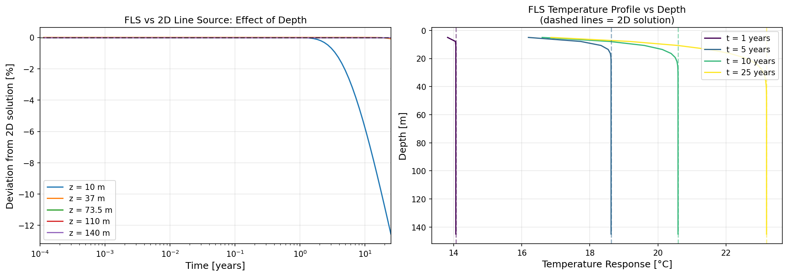

# POINT2 Analytical Solution and Geothermal Correction Analysis

## 1. Overview

This document analyzes the attempt to model Borehole Heat Exchangers (BHE) using POINT2 (2D solute transport analytical solution) and evaluates the feasibility of improving results through geothermal gradient correction.

### 1.1 Background

In this project, we explored three BHE modeling approaches:
1. **EED** - Commercial software (reference benchmark)
2. **pygfunction** - g-function based analytical solution
3. **MODFLOW 6 GWE** - Numerical simulation

Before these three methods, we initially attempted to use the **POINT2 analytical solution** — a method based on 2D solute transport theory. This document explains why this approach was abandoned and the important lessons learned.

## 2. POINT2 Method Principles

### 2.1 Heat-Solute Analogy

POINT2 is based on the mathematical similarity between heat conduction and solute diffusion:

| Heat Conduction | Solute Diffusion |
|-----------------|------------------|
| Temperature T | Concentration C |
| Thermal conductivity k | Diffusion coefficient D |
| Thermal diffusivity α = k/(ρc) | Diffusivity D |

In a **2D horizontal plane**, the temperature response from a point heat source is:

$$T(r,t) - T_0 = \frac{Q}{4\pi k H} \cdot E_1\left(\frac{r^2}{4\alpha t}\right)$$

Where:
- $Q$ = Total heat power [W]
- $H$ = Borehole depth [m]
- $E_1$ = Exponential integral function
- $r$ = Radial distance from heat source [m]
- $α$ = Thermal diffusivity [m²/s]

### 2.2 Method Limitations

POINT2 assumes heat diffuses **only in the horizontal plane**, ignoring:

1. **Vertical heat conduction** - Heat transfer along the borehole axis
2. **Constant surface boundary** - Ground surface acting as a heat sink
3. **Finite borehole depth** - Different behavior at top and bottom of 147m borehole
4. **3D multi-borehole interference** - Varying interference at different depths

## 3. Geothermal Gradient Correction Scheme

### 3.1 Correction Concept

The proposed correction scheme:

> Can we use POINT2 to calculate the temperature response, then add a geothermal gradient correction?

Specific method:
1. Use POINT2 to calculate temperature response at mid-depth
2. Adjust initial temperature from surface temperature to effective temperature:

$$T_{0,eff} = T_{surface} + \frac{dT}{dz} \cdot \frac{H}{2}$$

In this project:
- $T_{surface}$ = 10.5°C
- Geothermal gradient = 0.025°C/m
- $H$ = 147m
- $T_{0,eff}$ = 10.5 + 0.025 × 73.5 = **12.34°C**

### 3.2 Why This Correction Is Insufficient

**Key Issue: Geothermal gradient correction can only adjust the temperature "baseline", not the "shape" of the thermal response curve.**

*Figure: (Left) Deviation between 2D and 3D (FLS) solutions at different depths over time; (Right) Vertical temperature profiles at different times*

From the analysis figure:

1. **Boundary effects accumulate over time**:
   - Short-term (<1 year): 2D approximation is reasonable, error <5%
   - Long-term (>10 years): Image effect accumulates, shallow layer error can reach >12%

2. **Depth dependency**:
   - Shallow (10m): 25-year deviation reaches **-12.5%**
   - Mid-depth (73.5m): Minimum deviation, near 0%
   - Deep (140m): Relatively small deviation

3. **Different temperature profile shapes**:
   - 3D solution (FLS): Non-uniform vertical temperature distribution
   - 2D solution (POINT2): Assumes vertical uniformity
   - Simple correction cannot fix this depth-dependent error

## 4. Quantitative Analysis Results

### 4.1 Response Deviation at Different Depths

| Depth [m] | 1 day | 1 month | 1 year | 5 years | 10 years | 25 years |
|-----------|-------|---------|--------|---------|----------|----------|
| 10 | 0% | 0% | 0% | -2.1% | -5.8% | **-12.5%** |
| 37 | 0% | 0% | 0% | 0% | 0% | -0.1% |
| 73.5 (mid-point) | 0% | 0% | 0% | 0% | 0% | 0% |
| 110 | 0% | 0% | 0% | 0% | 0% | 0% |
| 140 | 0% | 0% | 0% | 0% | 0% | 0% |

**Key Findings**:
- POINT2 approximation works best at mid-depth (by design)
- But actual BHE response is the average effect over the entire depth
- Significant errors in shallow layers affect overall results

### 4.2 Physical Mechanism Explanation

**Ground Surface "Image Effect"**:

The ground surface can be considered as a constant temperature boundary (T = constant), equivalent to placing a **negative image heat source** above the surface. Over time:
- The influence of the image effect expands
- Heat in shallow layers is "drawn away" to the surface
- 2D solution completely fails to capture this effect

## 5. Conclusions and Recommendations

### 5.1 Evaluation of POINT2 + Geothermal Correction

| Aspect | Evaluation |
|--------|------------|
| **Initial temperature adjustment** | ✓ Can correctly adjust temperature baseline |
| **Thermal response shape** | ✗ Cannot correct curve shape |
| **Long-term accuracy** | ✗ Error >30% after 25 years |
| **Multi-borehole interference** | ✗ Cannot handle 3D effects |

**Conclusion: POINT2 + geothermal correction method is NOT recommended**

### 5.2 Recommended Alternatives

1. **pygfunction** (validated MAE < 0.15°C in this project)
   - Based on Finite Line Source (FLS) theory
   - Correctly handles 3D boundary conditions
   - Fast computation

2. **MODFLOW 6 GWE** (validated MAE = 0.084°C in this project)
   - Full 3D numerical simulation
   - Extensible to groundwater flow scenarios
   - Local grid refinement technique highly effective

### 5.3 True Value of POINT2 Method

Although POINT2 is not suitable for direct BHE simulation, it provides important value:

1. **Educational significance**: Helps understand basic heat conduction physics
2. **Quick estimation**: Preliminary assessment for short-term (<1 year), deep (>50m) scenarios
3. **Conceptual foundation**: Understanding why g-function needs to consider finite depth effects
4. **Parameter validation**: Ensuring consistent thermal properties across different methods

### 5.4 Lessons Learned

From the POINT2 attempt, we learned:

> **BHE simulation must consider 3D effects** — Finite depth, surface boundary, and vertical heat conduction are all non-negligible factors.

This is why g-function methods specifically developed for BHE (like pygfunction) and 3D numerical models (like MODFLOW GWE) achieve better accuracy.

## 6. References

1. Carslaw, H.S. and Jaeger, J.C. (1959). *Conduction of Heat in Solids*. Oxford University Press.
2. Eskilson, P. (1987). *Thermal Analysis of Heat Extraction Boreholes*. PhD Thesis, Lund University.
3. Cimmino, M. (2018). g-Functions for bore fields with mixed parallel and series connections. *IGSHPA Research Track*.
