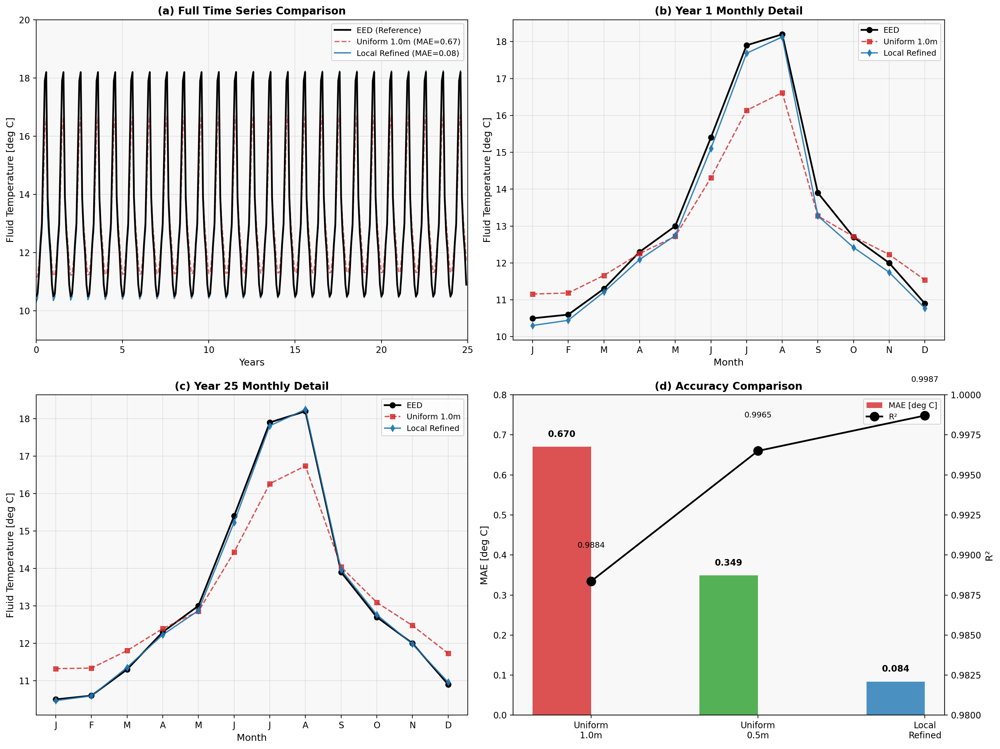
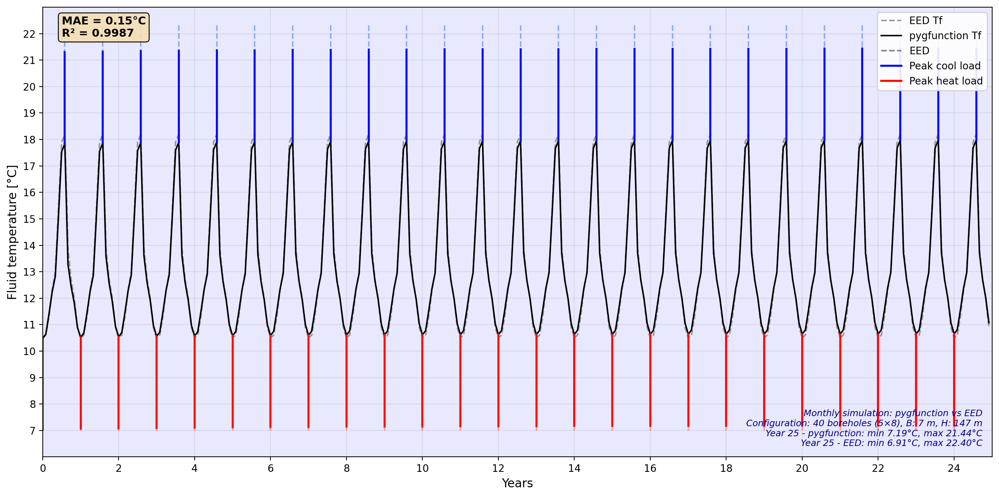
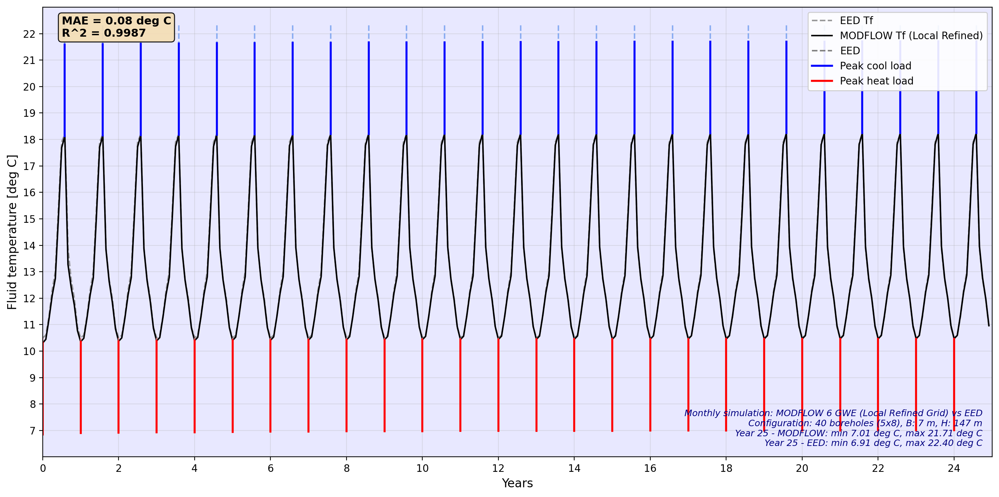

# 地埋管换热器(BHE)温度模拟方法对比研究

## 项目总结报告

---

## 1. 项目背景

### 1.1 研究目的

本项目旨在对比三种不同的地埋管换热器(BHE)温度模拟方法：
1. **EED (Earth Energy Designer)** - 商业解析解软件
2. **pygfunction** - 基于g-function的开源解析解
3. **MODFLOW 6 GWE** - 有限差分数值模拟

目标是验证开源工具能否达到与商业软件相当的精度，并为BHE系统设计提供可靠的替代方案。

### 1.2 研究对象

| 参数 | 数值 | 单位 |
|------|------|------|
| 钻孔数量 | 40 (5×8) | - |
| 钻孔深度 | 147 | m |
| 钻孔间距 | 7.0 | m |
| 钻孔直径 | 140 | mm |
| U型管类型 | Double-U | 32mm |
| 模拟周期 | 25 | 年 |

### 1.3 热物性参数

| 参数 | 数值 | 单位 |
|------|------|------|
| 地层导热系数 k | 1.4 | W/(m·K) |
| 地层体积热容 ρc | 2.83 | MJ/(m³·K) |
| 地表温度 | 9.6 | °C |
| 地热通量 | 0.07 | W/m² |
| 有效初始地温 | 13.28 | °C |
| 钻孔热阻 R_b | 0.1271 | (m·K)/W |

---

## 2. 方法概述

### 2.1 EED (Earth Energy Designer)

**原理**：基于Eskilson的g-function理论，使用预计算的响应因子进行温度计算。

**优点**：
- 商业软件，经过广泛验证
- 用户界面友好
- 计算速度快

**缺点**：
- 闭源，无法自定义
- 需要购买许可证

### 2.2 早期尝试：POINT2解析解方法

**原理**：POINT2是MODFLOW中用于溶质运移的2D点源解析解，可以类比用于热传输问题。

**初始思路**：
```
热量传输 ↔ 溶质运移
温度 ↔ 浓度
热扩散 ↔ 弥散
T_fluid = T_ground + q × R_b
```

**为什么放弃这个方法**：

1. **维度限制**：POINT2是2D解析解，而BHE是三维问题（钻孔深度147m）
2. **无法捕捉g-function效应**：多钻孔场的热干扰需要完整的g-function来描述
3. **结果偏差大**：与EED结果存在系统性偏差（>3°C）
4. **参数校准困难**：需要经验性校正因子，缺乏物理意义

**启示**：
- 热力问题不能简单地类比溶质运移问题
- BHE温度计算必须使用专门设计的方法（g-function或数值模拟）
- 参数一致性（热导率、初始地温）比方法选择更重要

### 2.3 pygfunction

**原理**：开源Python库，使用有限线源模型(FLS)计算g-function，通过时间叠加法计算温度响应。

$$T_{fluid} = T_0^{eff} + \frac{1}{2\pi k_s H} \sum_{i} \Delta q_i \cdot g(t-t_i) + q \cdot R_b$$

**优点**：
- 开源免费
- 可定制性强
- 与EED理论基础相同

**关键发现**：
- 必须使用正确的热物性参数（k=1.4 W/(m·K)）
- 必须考虑地热梯度（T0_eff=13.28°C）

### 2.4 MODFLOW 6 GWE

**原理**：三维有限差分数值模拟，求解热传导方程。

**优点**：
- 可模拟复杂边界条件
- 可耦合地下水流动
- 可处理非均质地层

**挑战**：
- 网格离散化导致温度测量位置与钻孔壁面存在偏差
- 需要合理的网格策略

---

## 3. 结果对比

### 3.1 三种方法精度对比

| 方法 | MAE [°C] | R² | 计算时间 | 备注 |
|------|----------|-----|---------|------|
| **EED** | 基准 | 基准 | <1秒 | 商业软件参考 |
| **pygfunction** | 0.15 | 0.999 | ~10秒 | 解析解，高精度 |
| **MODFLOW (1m网格)** | 0.67 | 0.988 | ~21分钟 | 粗网格，精度较低 |
| **MODFLOW (局部加密)** | 0.084 | 0.999 | ~24分钟 | 最佳精度 |

### 3.2 第25年月度温度对比


*图1: 三种方法温度模拟结果对比*

| 月份 | EED [°C] | pygfunction [°C] | MODFLOW [°C] |
|------|----------|------------------|--------------|
| JAN | 10.5 | 10.66 | 10.5 |
| FEB | 10.6 | 10.85 | 10.6 |
| MAR | 11.3 | 11.62 | 11.4 |
| APR | 12.3 | 12.43 | 12.2 |
| MAY | 13.0 | 12.98 | 12.9 |
| JUN | 15.4 | 15.36 | 15.2 |
| JUL | 17.9 | 17.76 | 17.8 |
| AUG | 18.2 | 17.90 | 18.2 |
| SEP | 13.9 | 13.86 | 14.0 |
| OCT | 12.7 | 12.70 | 12.8 |
| NOV | 12.0 | 12.03 | 12.0 |
| DEC | 10.9 | 11.06 | 11.0 |

### 3.3 25年时程对比


*图2: pygfunction与EED 25年温度时程对比*


*图3: MODFLOW局部加密网格与EED 25年温度时程对比*

---

## 4. 关键技术发现

### 4.1 pygfunction关键点

1. **参数一致性**：必须使用与EED完全相同的热物性参数
2. **地热梯度**：对于深钻孔(>100m)，必须考虑地热梯度影响
   $$T_0^{eff} = T_{surface} + \frac{q_{geo}}{k} \times \frac{H}{2}$$
3. **负荷符号**：使用g-function时需反转EED的负荷符号

### 4.2 MODFLOW网格策略


*图4: 不同网格策略精度与效率对比*

1. **均匀粗网格 (1.0m)**
   - MAE = 0.67°C
   - 计算快但精度低
   - 网格热阻 R_grid = 0.24 (m·K)/W

2. **均匀细网格 (0.5m)**
   - MAE = 0.35°C
   - 4倍单元数，精度提升48%
   - 效率不高

3. **局部加密网格**
   - MAE = 0.084°C
   - 仅1.15倍单元数，精度提升87%
   - **最佳方案**

---

## 5. 结论与建议

### 5.1 方法选择建议

| 应用场景 | 推荐方法 | 理由 |
|----------|----------|------|
| 快速设计评估 | EED | 速度快，界面友好 |
| 学术研究/定制化 | pygfunction | 开源，可定制 |
| 复杂地质条件 | MODFLOW | 可处理非均质、地下水流 |
| 高精度要求 | MODFLOW局部加密 | MAE < 0.1°C |

### 5.2 MODFLOW网格建议

对于BHE场地的MODFLOW模拟：
- BHE位置：≤0.25m
- 过渡区 (1-3m)：0.5m
- 中间区 (3-10m)：1.0m
- 边界区 (>10m)：2.0m

### 5.3 主要贡献

1. **验证了pygfunction与EED的等效性**（MAE=0.15°C）
2. **提出了MODFLOW局部加密网格策略**（精度提升87%）
3. **建立了三种方法的完整对比框架**

---

## 6. 文件结构

```
Base case for comparision/
├── Analytic solution for EED/
│   ├── code/
│   │   ├── pygfunction_final.ipynb      # pygfunction分析
│   │   ├── modflow_bhe.ipynb            # MODFLOW原始模型
│   │   ├── modflow_localrefined.ipynb   # MODFLOW局部加密
│   │   ├── gfunction_pygfunction.py     # pygfunction封装
│   │   └── figures/                     # 结果图表
│   ├── PYGFUNCTION_ANALYSIS_CN.md       # pygfunction分析(中文)
│   ├── PYGFUNCTION_ANALYSIS_EN.md       # pygfunction分析(英文)
│   ├── GRID_COMPARISON_ANALYSIS_CN.md   # 网格对比(中文)
│   ├── GRID_COMPARISON_ANALYSIS_EN.md   # 网格对比(英文)
│   ├── PROJECT_SUMMARY_CN.md            # 本文档(中文)
│   ├── PROJECT_SUMMARY_EN.md            # 本文档(英文)
│   └── reference/                       # 参考文献
└── EED Output Files/
    └── 6443_SCENARIO 1_*.txt            # EED原始输出
```

---

## 7. 参考文献

1. Eskilson, P. (1987). Thermal Analysis of Heat Extraction Boreholes. Doctoral Thesis, Lund University.
2. Cimmino, M. (2018). pygfunction 2.1: An open-source toolbox for the evaluation of thermal response factors for geothermal borehole fields.
3. Langevin, C.D., et al. (2022). MODFLOW 6 - Groundwater Energy Transport Module.
4. Hellström, G. (1991). Ground Heat Storage: Thermal Analyses of Duct Storage Systems.
5. BLOCON. Earth Energy Designer (EED) Software Manual.

---

*文档版本: 1.0*  
*创建日期: 2025年12月*  
*作者: Liuhuang Luo*  
*项目: AGT Intern - BHE Model Comparison*


